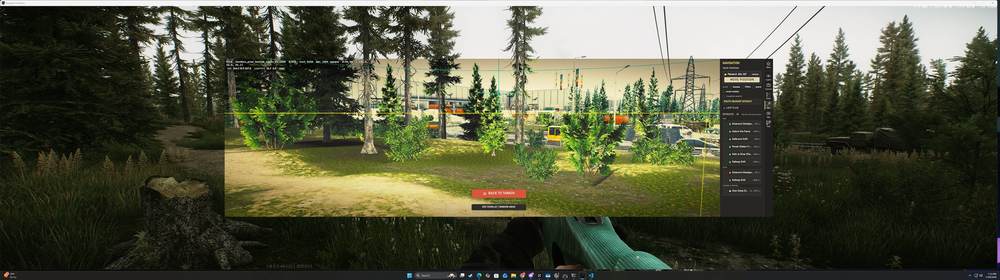

# Atlas

A native **Escape from Tarkov map viewer** for Windows and Linux. Everything on screen is
extracted from the game's own files — geometry, lights, water, glass, loot, fire — and rendered
by a GPU-driven Rust/Bevy engine: compute culling with Hi-Z occlusion, bindless materials,
cascaded shadows, baked SH global illumination, SSAO / SSR / TAA, volumetric sun shafts.


## Overlay mode

Atlas can put the map **over the running game**, standing exactly where you are.



**How it opens.** You press your own **in-game screenshot key**. Tarkov writes your position into
the screenshot's filename; Atlas watches for that file, turns it into a position fix, and raises
the overlay already framed on where you stand. There is deliberately **no global hotkey and no
input injection** — a registered hotkey would swallow that key machine-wide so the game never saw
it, a keyboard hook would observe every keystroke you type, and synthetic input is exactly what
anti-cheat looks for. The screenshot flow needs none of those, so Atlas listens to a file and
nothing else.

**How it lines up.** The panel is not a separate view of the map: Atlas projects the slice of the
world your window covers with an asymmetric frustum, so a tree on the overlay sits at the same
screen position as the tree behind it. The window itself is the same one Atlas always draws into —
no second window, no second renderer — it simply drops its decorations, goes always-on-top, and
resizes against the game's client rect.

**How it closes.** The big **BACK TO TARKOV** button, or `~` while Atlas has focus. Either
minimises Atlas so Windows hands the foreground straight back to the game. The dismiss key is
configurable in the settings panel.

**One requirement:** the game must be in **windowed** or **borderless** mode. Nothing can be drawn
over exclusive fullscreen — that's a platform rule, not something a program can work around.

## Run

Grab a build from Releases, unzip it, and **double-click `atlas.exe`** — it opens a menu where you
pick a map and build or load its pack. No command line needed.

If you prefer one, you can point it straight at a pack instead:

```
atlas.exe packs/<map>.eftpack
```

Packs are built from your own game install (the menu's build button, or
`python tools/build_map.py <map> --alllod`). Game-derived data never ships with this repository.
