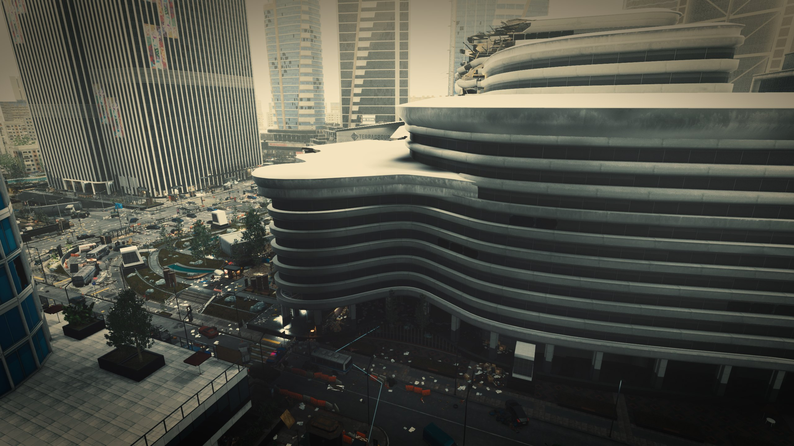
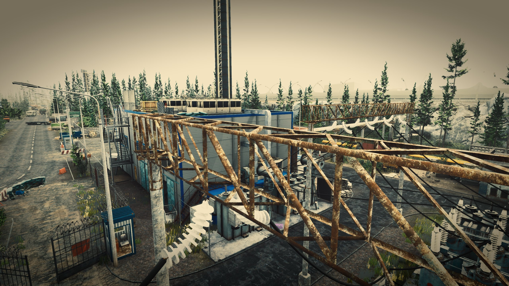
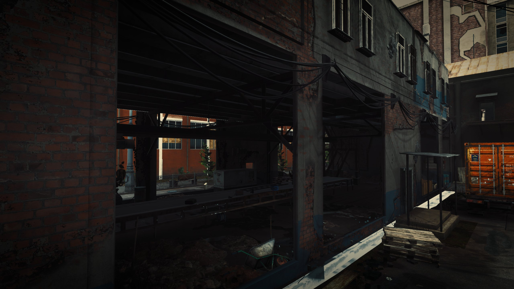

# Atlas

A native **Escape from Tarkov map viewer** for Windows and Linux. Everything on screen is
extracted from the game's own files — geometry, lights, water, glass, loot, fire — and rendered
by a GPU-driven Rust/Bevy engine: compute culling with Hi-Z occlusion, bindless materials,
cascaded shadows, baked SH global illumination, SSAO / SSR / TAA, volumetric sun shafts.








## Run

Grab a build from Releases and point it at a pack:

```
atlas.exe packs/<map>.eftpack
```

Packs are built locally from your own game install (`python tools/build_map.py <map> --alllod`).
Game-derived data never ships with this repository.
