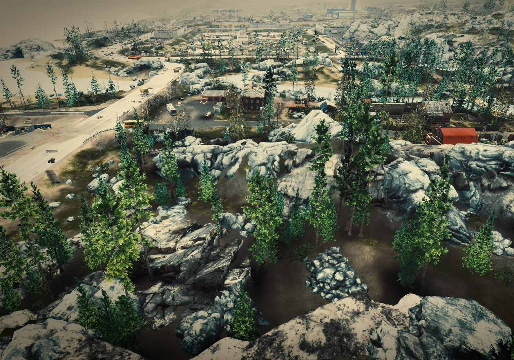
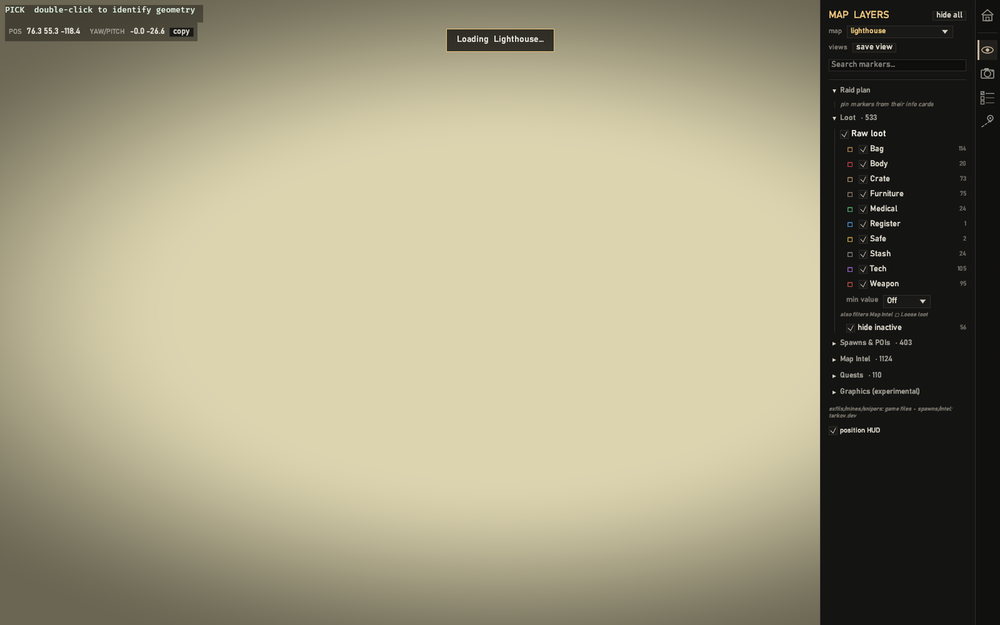
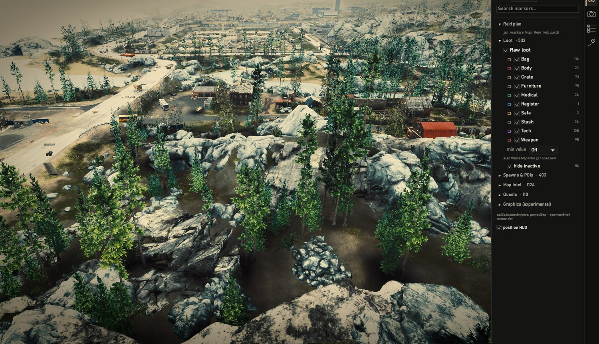

# Atlas



A fast, native **map viewer and raid planner for Escape from Tarkov**, for
**Windows and Linux**. It renders each map in real 3D and overlays the things you
actually plan around — extracts, loot, keys, hazards, spawns, patrols, quest
objectives — with search and experimental point-to-point routing on top.

It's a normal desktop app: double-click and go. No browser, no account, no
internet required to use it.

## ✨ What it does

- **The real map, in 3D.** Geometry, terrain, and materials extracted from *your
  own* game files, rendered natively (GPU-driven renderer, the game's actual light
  placements, baked global illumination, cached sun shadows). Fly anywhere; nothing
  is a hand-drawn approximation.
- **First-party spawn intel.** Exact PMC and scav spawn points, **bot zones** with
  their real footprints, and **bot patrol routes** — read from the game's own AI
  data, not community guesses. Boss markers sit on their true zones, with spawn
  odds and escorts from [tarkov.dev](https://tarkov.dev).
- **Raid-planning layers.** Extracts by faction (with their activation zones and
  power/switch requirements), typed doors with the exact key that opens them,
  minefields and sniper zones with real boundaries, stationary weapons, transits,
  airdrop landing spots, even the event cultist ritual sites.
- **Loot that's worth your time.** Containers and loose-loot spawns with live
  prices, filterable by class and minimum value, plus quest objectives with full
  task tracking.
- **A legend that explains itself.** Every line style on the map (solid = authored
  by the game, dashed = derived, dots + arrows = patrol order) is documented right
  in the layers panel.
- **Live game link.** Atlas watches your game's logs and screenshots: it detects
  which raid you're in, places you on the map from a screenshot, and can summon
  itself as an overlay on your screenshot key.
- **Routing — ⚠️ work in progress.** Click a destination and Atlas computes a
  walkable route. **Treat every route as a rough draft**: see
  [Pathfinding is a work in progress](#pathfinding-is-a-work-in-progress) below
  before trusting it with your kit.
- **Offline and yours.** Maps are per-map packs on your disk. Viewing needs no
  internet, no account, no background services.

## ⬇️ Download & run

**[Download Atlas for Windows (portable `.zip`)](https://github.com/ConocoFieldsForever/atlas/releases)**
— unzip it anywhere (your Desktop is fine) and **double-click `atlas.exe`** — that's
it. No installer, no account, and no internet needed to view maps. On first launch
the map manager opens; build a map once from your own game files, then hit **Play**.
(Full walkthrough in [Getting started](#getting-started-2-minutes) below.)

**On Linux?** Atlas runs natively (Vulkan) — including building maps from a
Wine/Proton/Lutris EFT install. There's no prebuilt binary yet, so build it from
source in about two commands: see **[Linux](#linux)** below.





> **Legal, in one line:** Atlas only shows maps built from *your own* copy of
> Escape from Tarkov, on your own PC. Map data is never bundled with the app. See
> [LICENSE-NOTES.md](LICENSE-NOTES.md).

---

## Will it run on my PC?

You need:

- **Windows 10 or 11** (64-bit), or **Linux** (built from source — see
  [Linux](#linux); tested on Ubuntu with NVIDIA + Vulkan)
- **A graphics card from roughly the last 10 years** (anything that supports
  Vulkan or DirectX 12 — basically any modern laptop or desktop GPU)
- **About 1 GB of free space** for the app, plus **1–10 GB per map** you install

You do **not** need to install Python, a runtime, or anything else just to run
Atlas and view maps on Windows. The Visual C++ runtime is built into the app, so
there's nothing extra to install.

---

## Getting started (2 minutes)

1. **Unzip** the Atlas folder anywhere you like (Desktop is fine). Keep the files
   together — `atlas.exe`, the `assets` folder, and the `packs` folder must stay
   side by side.
2. **Double-click `atlas.exe`.** The menu opens.
   - The first time, Windows may show a blue **"Windows protected your PC"** box
     because the app isn't code-signed. Click **More info → Run anyway.** (This is
     normal for indie software; nothing is being installed.)
3. You'll see the map list. To actually open a map, you need one installed — see
   the next section.

---

## Getting maps to view

A "map" in Atlas is a folder called a **pack** (ending in `.eftpack`). You get one
of two ways:

### Option A — Someone shares a pack with you (easiest)

If a friend sends you a built map pack:

1. Drop the `.eftpack` folder into the **`packs`** folder next to `atlas.exe`.
2. Restart Atlas (or press it if already listed). The map now shows as **READY**.
3. Press **PLAY**.

That's it — no Python, no game files needed on your end.

### Option B — Build maps from your own game (more involved)

Atlas can build maps straight from your Escape from Tarkov install. This is the
"full kit" and asks a bit more of you:

- The Atlas download already includes everything the builder needs — the `tools` /
  `eft_pipeline` / `extraction` folders **and its own bundled Python**, so you do
  **not** need to install Python.
- You need **Escape from Tarkov installed** on the same PC.
- You need an **internet connection while building** — Atlas fetches a few Python
  packages the first time, plus loot values, quest data, and item icons from the free
  community API at [tarkov.dev](https://tarkov.dev). (Viewing a finished map stays
  fully offline.)

Then:

1. Launch `atlas.exe`. The first time, click **INSTALL DEPS** in the menu — it uses
   the bundled Python to fetch the extraction packages (one-time, needs internet). No
   Python install and no `bootstrap.ps1` needed. (Advanced/offline setups can still
   run `bootstrap.ps1`.)
2. At the bottom of the menu:
   - **GAME INSTALL** — point it at the **`EscapeFromTarkov_Data`** folder inside your
     Tarkov install (e.g. `…\Escape from Tarkov\EscapeFromTarkov_Data`). Both the **BSG
     launcher** and **Steam** installs are auto-detected (including Steam libraries on
     other drives) — if yours isn't found, paste the path and press **SET**.
   - **EXTRACTED ASSETS** — press **CHOOSE…** and pick a folder with plenty of free
     space (the extracted map data lands here — budget **~1–6 GB per map**).
3. **Close the game and its launcher** (the extractor needs the files unlocked),
   then press **BUILD** on a map row. The **first** build of a map runs a one-time
   extraction from your game files and can take a while (tens of minutes for a big
   map); it then assembles the pack. Progress streams live. When it finishes the
   row turns **READY** and you can **PLAY**. Re-building or building other maps
   afterward is much quicker.
4. If a row later says **GAME FILES UPDATED**, the game got patched — press
   **UPDATE** to rebuild it.

> The extraction is resumable — if it's interrupted, pressing BUILD again picks up
> where it left off. An NVIDIA graphics card makes the lighting look better but
> isn't required.

---

## Controls

| Do this | To |
|---|---|
| **W A S D** | move around |
| **Hold right mouse button + move mouse** | look |
| **Q / E** | go down / up |
| **Hold Shift** | move faster |
| **Double-click** something | identify what it is |
| **House icon** (top-left) | go back to the map menu |

The panel on the right has layers (loot, extracts, quests…), search, and routing.
Click a destination to get a walkable route to it — but read the next section first.

---

## Pathfinding is a WORK IN PROGRESS

Atlas can compute point-to-point walking routes on a navigation grid baked from
the real map geometry — and it's the **least finished feature in the app**. It is
under active development. Right now you should expect:

- **Routes that are wrong.** A path may hug walls oddly, take a long way around,
  climb something a player can't, or thread a gap a player can't fit through.
- **Doors and obstacles are only partially understood.** Locked doors, breachable
  doors, and one-way drops aren't all modeled yet — a route may confidently walk
  you through a door your key won't open.
- **Unreachable islands.** Some spots (rooftops, ledges, water edges) aren't
  connected to the walkable graph yet, and routing to or from them can fail
  outright or snap to a nearby point you didn't pick.
- **No danger awareness.** Routes don't avoid minefields, sniper zones, or open
  sightlines — the overlays show those; the router doesn't read them yet.

**Treat every route as a sketch, not a promise.** Cross-check it against the
layers before you commit your kit to it. If a route does something absurd,
that's expected at this stage — the nav bake and the router are being reworked.

---

## Troubleshooting

**The menu opens but every map says "NOT INSTALLED."**
That's expected on a fresh copy — Atlas ships with no maps. Get one via Option A or
B above.

**Windows / my antivirus warns about the app.**
Atlas isn't code-signed, so Windows SmartScreen and some antivirus tools flag it as
"unknown." It's safe to allow (**More info → Run anyway**). If antivirus quarantines
`atlas.exe`, add an exception for the Atlas folder.

**The window opens black, or the app closes immediately.**
Update your graphics drivers (NVIDIA/AMD/Intel) — Atlas needs a GPU that supports
Vulkan or DirectX 12. (No Visual C++ redistributable or other runtime is needed —
the C runtime is built into the app.)

**The BUILD button does nothing or shows an error.**
Building maps (Option B) needs the `tools`/`eft_pipeline` folders beside the exe
(they come in the download), Python 3.10+ installed, and your Tarkov install — and
make sure you ran `bootstrap.ps1` first.

**BUILD says "no dataset" / the extraction fails.**
Make sure you set **EXTRACTED ASSETS** (a folder with free space) and **GAME
INSTALL** at the bottom of the menu, and that you ran `bootstrap.ps1` (it installs
UnityPy, which the extractor needs). The **game and its launcher must be closed** —
they lock the files the extractor reads.

**The first BUILD looks stuck on the first step for a long time.**
That's the one-time extraction working — it can take tens of minutes on a big map.
Watch the streaming log lines; it's making progress. Later builds skip this step.

**It feels like it's holding back / low frame rate.**
By design, Atlas caps to your monitor's refresh rate and goes nearly idle when its
window isn't focused, so it won't hog your GPU while your game is in front. Keep the
Atlas window focused for full speed.

---

## For developers

The renderer design, the pack format, and the extraction pipeline are documented in
**[ARCHITECTURE.md](ARCHITECTURE.md)**. Quick build from source:

```powershell
cargo run --release -p atlas                                  # menu
cargo run --release -p atlas -- .\packs\interchange.eftpack   # open a pack directly
```

Needs stable Rust 1.88+. A fuller list of environment toggles is in
[README_DIST.md](README_DIST.md).

### Linux

Atlas supports Linux natively — the viewer builds and runs out of the box (tested on Ubuntu
26.04 + an NVIDIA RTX 3090 via Vulkan; no Wine needed for Atlas itself). The extraction
pipeline (Option B, building maps from your own game files) also works, including through a
Wine/Proton/Lutris install of EFT — you just need to point **GAME INSTALL** at the right
`EscapeFromTarkov_Data` folder by hand, since the auto-detect (Windows registry + drive-letter
probing) is Windows-only. There's no prebuilt Linux binary yet — build from source below (two
commands once the system packages are in).

Install Rust and the system libraries Bevy needs to open a window and talk to the GPU:

```bash
curl --proto '=https' --tlsv1.2 -sSf https://sh.rustup.rs | sh -s -- -y
source "$HOME/.cargo/env"

sudo apt update
sudo apt install -y build-essential pkg-config \
  libx11-dev libxi-dev libxcursor-dev libxrandr-dev libxkbcommon-dev \
  libwayland-dev \
  libvulkan1 mesa-vulkan-drivers vulkan-tools \
  libgtk-3-dev \
  libasound2-dev libudev-dev
```

Then build and run exactly as above, just with forward slashes:

```bash
cargo run --release -p atlas
cargo run --release -p atlas -- packs/interchange.eftpack
```

Notes:
- `vulkaninfo --summary` should list at least one GPU before you launch — if it lists none, update
  your GPU driver (the NVIDIA proprietary driver, or Mesa for AMD/Intel).
- The Python build pipeline (INSTALL DEPS / BUILD in the menu) needs `python3`. On Debian/Ubuntu,
  a freshly created venv can come up with no `pip` at all (the distro strips the bundled wheel out
  of `ensurepip`) — `tools/setup_deps.py` detects this and retries with `--system-site-packages`
  automatically; if that still fails, `sudo apt install python3-pip` first.

---

## Credits & data

Map geometry, lighting, and terrain are extracted from *your* game files on *your*
PC. Prices, quests, and item icons come from the free community API at
[tarkov.dev](https://tarkov.dev) — please credit them in anything public. What may
and may not be shared is spelled out in [LICENSE-NOTES.md](LICENSE-NOTES.md).
